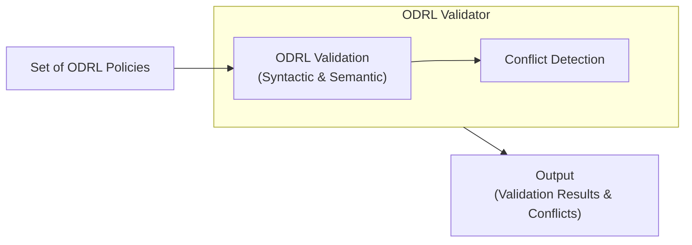
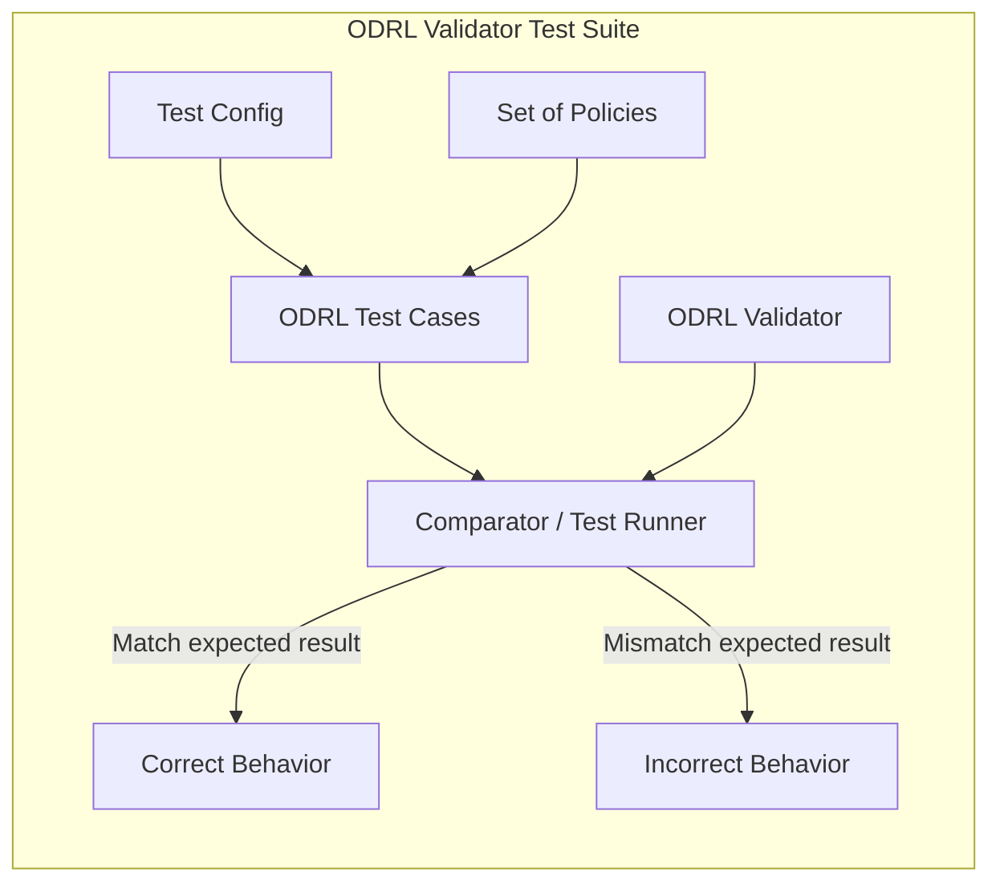

# ODRL Validator

The ODRL Validator is a Typescript tool to aid development of consistent [ODRL](https://www.w3.org/TR/odrl-model/) policies.
This means the tool can validate whether the policies are syntactically (the correct syntax using the ODRL Vocabulary) and semantically (the terms are used in the correct place according to the model) correct.
Furthermore, the tool can detect whether the policies do not contain inconsistencies, that is do they contain two or more rules that contradict each other.


The repository additionally contains a test suite that is used to validate the correctness and robustness of the ODRL Validator.
The test suite consists of:

- A set of ODRL policies expressed as RDF files.
- A [configuration file](./config.json) that defines the expected validation outcome for each policy, including:
    - Whether the policy is expected to be valid or invalid.
    - For valid policies, whether they are contain logical inconsistencies; and if so which ones

Together, the policies and the configuration file are combined into test cases, which are executed against the ODRL Validator.
The actual validator output is then compared with the expected results defined in the configuration in order to determine whether the validator behaves correctly.

Data origin
- `data/policies`: [ODRL Test Suite](https://github.com/SolidLabResearch/ODRL-Test-Suite) from the paper [Interoperable Interpretation and Evaluation of ODRL Policies](https://link.springer.com/chapter/10.1007/978-3-031-94578-6_11 )
- `data/samples`: [ODRL Validator](https://odrlapi.appspot.com/) by UPM and Wright State University
- `data/rdflicenses`: [Licensius](https://github.com/oeg-upm/licensius), a collection of RDF licenses as ODRL policies

## Architecture

ODRL Validator

Test suite



## Running the ODRL Validator 
TODO: rewrite this section (idea, document how to run the tool and high level how it works)
ODRL validator
- ODRL structural validator

Conflict detection
- Deontic validator
- Lex Specialis
- constraint/refinement similarity
- correct constraint operator detection

## Running the test suite 

TODO: rewrite this section (idea, document how to run the test suite and high level how it works)
1. document test case format
2. load in all policies

```sh
# Install the packages
npm i

# Running the test suite
npx tsx demo.ts
```

## Comments
- `uid` property 
  - In JSON-LD, ODRL’s `uid` is mapped to `@id` to uniquely identify policies or rules. (Victors policy do not have this property)
  - suggestion: In Turtle (TTL), this mapping isn’t required, so `uid` can be omitted while still remaining ODRL-compliant.
