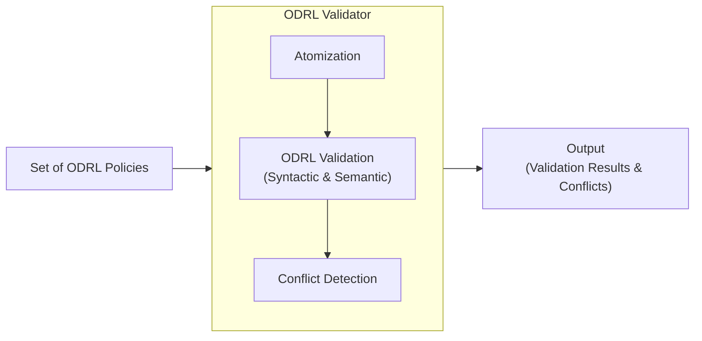

# ODRL Validator
[](https://www.npmjs.com/package/odrl-validator)

The ODRL Validator is a Typescript tool to aid development of consistent [ODRL](https://www.w3.org/TR/odrl-model/) policies.
This means the tool can validate whether the policies are syntactically (the correct syntax using the ODRL Vocabulary) and semantically (the terms are used in the correct place according to the model) correct.
Furthermore, the tool can detect whether the policies do not contain inconsistencies, that is do they contain two or more rules that contradict each other.

An online version of the ODRL Validator can be found [here](https://odrl-force.github.io/ODRL-Validator-Demo/).

## Architecture

ODRL Validator

```mermaid
flowchart LR
    Policies["Set of ODRL Policies"]

    subgraph ODRLValidator["ODRL Validator"]
        Atomization --> Validation
        Validation["ODRL Validation\n(Syntactic & Semantic)"]
        ConflictDetection["Conflict Detection"]
        Validation --> ConflictDetection
    end

    Output["Output\n(Validation Results & Conflicts)"]

    Policies --> ODRLValidator
    ODRLValidator --> Output
```

## Running the ODRL Validator 

The following example demonstrates how to parse a policy and run the validator.
```ts
import { ODRLValidator } from "odrl-validator";
import { Parser } from "n3";

const policyText = `
    @prefix odrl: <http://www.w3.org/ns/odrl/2/> .
    @prefix ex:   <http://example.org/> .

    ex:policy
        a odrl:Policy ;
        odrl:permission  ex:permissionRule ;
        odrl:prohibition ex:prohibitionRule .

    ex:permissionRule
        a odrl:Permission ;
        odrl:target   ex:resource ;
        odrl:assignee ex:alice ;
        odrl:action   odrl:use .

    ex:prohibitionRule
        a odrl:Prohibition ;
        odrl:target   ex:resource ;
        odrl:assignee ex:alice ;
        odrl:action   odrl:use .
        
    ex:alice a odrl:Party .
    ex:resource a odrl:Asset .
  `;

const quads = parser.parse(policyText);
const validator = new ODRLValidator();
const results = await validator.validate(quads);

console.log(results);
```
The validator operates in two stages:
1. **SHACL validation**  
   The input policy is first checked against the ODRL information model using SHACL constraints.
2. **Conflict detection**  
   If the policy passes validation (i.e. no violations), conflict detection is performed.  
   Currently, this step focuses on identifying **deontic conflicts**.


Therefore the output of the `validate` function (`ValidatorResult`) contains three fields:
* **`valid`**: `true` iff no SHACL violations were found
* **`validationResults`**: SHACL outcomes
  * `Warning`: Indicates a potential issue, but does not invalidate the policy.
  * `Violation`: Indicates an error against the ODRL information model. 
* **`conflicts`**: detected inconsistencies
  * `message`: describes the **reason for the conflict**
  * It also identifies the **two rules involved** (`ruleA` and `ruleB`)

In the future, we want to include more kinds of conflicts:
- Lex Specialis
- constraint/refinement similarity
- correct constraint operator detection

## Comments
- `uid` property 
  - In JSON-LD, ODRL’s `uid` is mapped to `@id` to uniquely identify policies or rules. (Victors policy do not have this property)
  - suggestion: In Turtle (TTL), this mapping isn’t required, so `uid` can be omitted while still remaining ODRL-compliant.

## Feedback and questions

Do not hesitate to [report a bug](https://github.com/elenamolino/odrl-validator/issues).

Further questions can also be asked to [Wout Slabbinck](mailto:wout.slabbinck@ugent.be) or [Elena Molino](https://github.com/elenamolino) (developers and maintainers of this repository).
